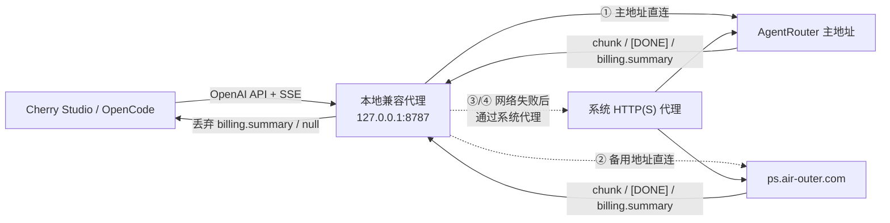

# 写在前面：鸣谢

本项目采用 SheAPI 提供的免费 gpt-5.6 完成编码。

你也可以通过[我的邀请码](https://www.sheapi.top/sign-up?aff=8uZS) 加入。用我的邀请码注册，方能赠送 \$1。

倍率 0.03x，经久耐用，每天还能获得 0.1~1 的签到奖励，续航时间长。


# AgentRouter OpenAI Compatibility Proxy

一个轻量、本地运行的 OpenAI 兼容代理，用于解决 AgentRouter 与 **Cherry Studio**、**OpenCode** 等客户端组合时的常见兼容性和网络连接问题：

1. 上游在一次正常的流式响应结束后，额外发送 `object: "billing.summary"` 的 SSE 数据帧；
2. 严格遵循 OpenAI 响应 schema 的客户端把该帧当成聊天响应解析，因其中没有 `choices` 或 `error` 而报 `invalid_union`，进而中断 Agent/自动化流程。
3. 部分 Claude/Opus 路由在工具调用前额外发送 `data: null`，导致 OpenCode 报 `Invalid input: expected object, received null`。
4. 直连 AgentRouter 遇到 DNS、连接、TLS 或超时故障时，请求无法自动利用系统代理或官方备用域名恢复。

本项目只移除不属于 OpenAI 聊天流协议的 `billing.summary` 和字面量 `null` 事件，其余数据逐帧透传。尤其是，它会将 OpenCode 发出的 `Authorization`、`User-Agent`、`Accept` 等请求头**原样转发到 AgentRouter**；代理不会替换、删掉或生成这些鉴权相关头。

网络连接默认采用“主域名直连 → 官方备用域名直连 → 主域名系统代理 → 备用域名系统代理”的自动恢复顺序。只在网络层失败时切换；只要上游已经返回 HTTP 响应（包括 `401`、`403`、`429`、`500`），就立即原样返回，不会重复提交请求。

## 最快使用方式（Windows）

无需在终端输入 `npm start`：

1. 双击 `01-一键配置.cmd`；
2. 按提示确认 AgentRouter 地址、端口，并选择是否登录 Windows 后自动启动；
3. 配置完成后它会自动启动代理；
4. 在 Cherry Studio 中填写本地代理地址，直接使用。

**只使用 Cherry Studio 时，不需要下载或安装 OpenCode。**代理自带可立即使用的兼容请求头配置。

备用域名与系统代理回退默认同时开启，不需要手工填写代理端口。程序会自动读取 `HTTPS_PROXY` / `HTTP_PROXY` / `ALL_PROXY`，也会读取 Windows 当前用户的静态“Internet 选项”代理。

日常操作：

| 文件 | 用途 |
| --- | --- |
| `01-一键配置.cmd` | 首次配置、修改端口或重新设置自启动 |
| `02-一键启动.cmd` | 立即在**后台隐藏启动**代理 |
| `03-检查状态.cmd` | 检查代理是否正在运行及当前端口 |
| `04-停止代理.cmd` | 停止后台代理 |

之后登录 Windows 会自动启动（如果你在向导中选择启用）。无需再手动执行 `npm start`。
后台运行不会弹出黑色窗口；启动失败或需要排查时，查看 `logs\proxy.out.log` 与 `logs\proxy.err.log`。

## 这解决了什么

你看到的错误本质上是：

```text
expected array at choices, received undefined
expected object at error, received undefined
object: "billing.summary"
```

正常的 OpenAI Chat Completions SSE 流应为一系列 `chat.completion.chunk`/`[DONE]` 事件。账单摘要并不是一个聊天 chunk；客户端完成解析后又收到它，便会将其误判为异常响应。



## 快速开始（Windows / macOS / Linux）

### 1. 前置条件

- Node.js **20 或更高版本**
- 一个仍有效的 AgentRouter API Key
- AgentRouter 控制台中显示的 OpenAI-compatible Base URL

### 2. 下载并配置

```powershell
git clone https://github.com/dsyoierDSY/AgentRouterFix.git
cd AgentRouterFix
.\01-一键配置.cmd
```

一键配置会生成 `.env`。`UPSTREAM_BASE_URL` 必须是完整 API 基址，包括服务商要求的路径前缀（例如 `/v1`）。

默认生成的网络恢复配置为：

```dotenv
UPSTREAM_FALLBACK_BASE_URLS=https://ps.air-outer.com
SYSTEM_PROXY_FALLBACK=true
UPSTREAM_CONNECT_TIMEOUT_MS=10000
SYSTEM_PROXY_URL=
```

`SYSTEM_PROXY_URL` 通常保持为空；程序会自动发现系统代理。官方备用域名会自动继承主地址的 API 路径，例如主地址以 `/v1` 结尾时，备用地址也会请求 `/v1`。

### 3. 启动

双击 `02-一键启动.cmd`。它不依赖 `npm install`，只需要 Node.js 20 或更高版本。

健康检查：

```powershell
Invoke-RestMethod http://127.0.0.1:8787/healthz
```

应返回：

```json
{"ok":true,"service":"agentrouter-openai-compat"}
```

### 4. Windows 开机/登录自动启动（只需执行一次）

```powershell
.\01-一键配置.cmd
```

在向导中选择“登录 Windows 后自动启动代理”。脚本会在当前 Windows 用户的「启动」目录中创建静默启动器。

- 立即手动启动：双击 `02-一键启动.cmd`
- 取消自动启动：

  ```powershell
  npm run uninstall-startup
  ```

代理会在后台隐藏运行，不会因为误关命令窗口而停止。需要关闭时，双击 `04-停止代理.cmd`。

### 5. Cherry Studio 请求头兼容（自动，无需 OpenCode）

如果你的账户被上游按客户端识别头区分，代理默认启用 Cherry Studio 兼容模式。内置兼容请求头会在首次启动时立即生效，因此可以直接使用 Cherry Studio。

Cherry Studio 的请求会保留自己的 `Authorization`，同时使用内置的兼容 `User-Agent`、`Accept`、`Accept-Language` 等识别头。

如果用户本来就安装了 OpenCode，并让它通过本代理发送请求，代理可以选择性地将实际客户端识别头保存到 `.client-header-profile.json`，用于更新内置配置。这只是可选增强，不是使用 Cherry Studio 的前置步骤。

该文件不会被 Git 跟踪。日志中出现以下内容，表示可选配置已经更新：

```text
INFO Captured OpenCode header profile for Cherry Studio compatibility.
```

## Docker 部署（局域网 / 服务器）

适合部署到常开的机器或 NAS，供局域网内多台设备共用。与上面的 Windows 方式并列，两者互不影响。

### 1. 前置条件

- Docker Engine 与 Compose v2（`docker compose version` 可用）
- **不再需要**在宿主机安装 Node.js
- 一个仍有效的 AgentRouter API Key

### 2. 配置

```bash
cp .env.example .env
```

编辑 `.env`，至少填写 `UPSTREAM_BASE_URL`。`HOST` 保持 `127.0.0.1` 即可，`docker-compose.yml` 会自动覆盖为 `0.0.0.0`。

局域网部署**强烈建议**设置 `LOCAL_PROXY_API_KEY`：

```dotenv
LOCAL_PROXY_API_KEY=你的AgentRouterApiKey
```

> **⚠️ 该值必须与你的 AgentRouter API Key 完全相同。**
> 本代理不存储任何上游凭据，客户端的 `Authorization` 会被原样透传到上游。若在此填写一个自定义密码，本地鉴权会通过、但上游会返回 401。

### 3. 启动

```bash
docker compose up -d --build
```

### 4. 健康检查

```bash
curl http://127.0.0.1:8787/healthz
```

应返回：

```json
{"ok":true,"service":"agentrouter-openai-compat"}
```

健康检查端点不需要鉴权，即使设置了 `LOCAL_PROXY_API_KEY` 也能直接访问。

### 5. 日常操作

| Windows 方式 | Docker 方式 |
| --- | --- |
| `02-一键启动.cmd` | `docker compose up -d` |
| `03-检查状态.cmd` | `docker compose ps` |
| `04-停止代理.cmd` | `docker compose down` |
| 查看 `logs\proxy.*.log` | `docker compose logs -f` |
| 向导中的开机自启 | `restart: unless-stopped`（已内置） |

### 6. 客户端连接

将下方「Cherry Studio 配置」「OpenCode 配置」中的 `127.0.0.1` 换成运行 Docker 的主机局域网 IP，其余填法完全一致。

### 7. 安全提示

本代理**不存储任何上游凭据**，因此局域网暴露不会导致他人白嫖你的 AgentRouter 额度——没有有效 Key 的请求会被上游直接拒绝。但仍有两点需要注意：

- **请求头档案投毒**：任何人只要发送 `User-Agent` 含 `opencode` 的请求，就能把任意请求头写入 `.client-header-profile.json`，该档案随后会作用于全部 Cherry Studio 请求。鉴权检查发生在写入之前，因此**设置 `LOCAL_PROXY_API_KEY` 可以完全封堵这一途径**——这正是推荐启用它的主要原因。
- **明文传输**：局域网内为 HTTP 明文，客户端 API Key 可能被嗅探。建议仅在可信内网使用，或在前面加一层反向代理提供 TLS。

默认不持久化 `.client-header-profile.json`：该文件只是可选缓存，缺失时会自动回落到内置兼容请求头。如确需持久化，可挂载卷并设置 `CLIENT_HEADER_PROFILE_FILE=/data/.client-header-profile.json`（需为绝对路径）。

## Cherry Studio 配置

新建一个 **OpenAI 兼容**（或 Custom OpenAI）提供商：

| 设置项 | 值 |
| --- | --- |
| API Base URL | `http://127.0.0.1:8787` |
| API Key | 原本用于 AgentRouter 的 API Key |
| 模型 | 例如 `gpt-5.5`、`gpt-5.6-sol`、`claude-opus-4.6`、`4-7`、`4-8`、`glm-5.2`、`kimi-k3` |

请选择 **设置 → 模型服务 → 添加 → 自定义服务商 → OpenAI 兼容**。在 Cherry Studio 的「API 地址」中填 `http://127.0.0.1:8787`（不要手动追加 `/v1`）；客户端会自行追加 OpenAI API 路径。代理同时兼容 Cherry Studio 生成的 `/models`、`/chat/completions` 路径和带 `/v1` 的路径，最终会正确转发到你配置的 `UPSTREAM_BASE_URL`。

如果 Cherry Studio 在保存或模型列表探测时仍提示 `unauthorized client detected`：

1. 先确认它访问的是 **`http://127.0.0.1:8787`**，而不是 AgentRouter 的 URL；
2. 确认客户端实际发送的 `Authorization` 与 `User-Agent` 没有被其自身设置覆盖；
3. 确认代理终端没有上游 `401/403` 日志；
4. 仍失败时，保留终端中的**状态码、请求路径、request-id（如有）**并联系 AgentRouter 支持。

## OpenCode 配置

在 OpenCode 中创建一个 OpenAI-compatible Provider，填入：

```text
Base URL: http://127.0.0.1:8787/v1
API key:  <原本填写给 AgentRouter 的 API Key>
```

模型名按 AgentRouter 账户可见模型填写。关键点是：**OpenCode 不再直接访问 AgentRouter**，而是访问本地代理；代理会保留 OpenCode 的全部端到端请求头并转发到 AgentRouter。这样账单 SSE 帧不会进入 OpenCode 的 OpenAI schema 校验器，Agent 流程就不会因 `billing.summary` 失败。

不同 OpenCode 版本的配置文件字段名可能不同；无论通过 UI 还是配置文件设置，目标都是上述 Base URL 和 API key。

## 工作方式与边界

### 仅丢弃什么

仅当一个完整 SSE event 的 `data:` JSON 满足以下条件时，默认丢弃：

- `object === "billing.summary"`，或
- 带有顶级 `billing` 对象，且不是 OpenAI 的 `choices` / `error` 载荷。
- 字面量 `null`（部分 Claude/Opus 工具调用流会发送该无效帧）。

不会修改：

- OpenCode 的 `Authorization` / `User-Agent` / 其他端到端请求头
- `chat.completion.chunk`
- tool calls
- reasoning content
- `[DONE]`
- HTTP 状态码和普通 JSON 响应

所有丢弃仅写入本机代理日志，且不会记录 Authorization 值。

### 上游网络自动恢复

每个请求默认按以下顺序尝试：

1. `.env` 中 `UPSTREAM_BASE_URL` 指定的地址直连；
2. 官方备用域名 `https://ps.air-outer.com` 直连，并保留相同 API 路径、请求参数、请求头和 POST 请求体；
3. 主地址通过系统 HTTP(S) 代理访问；
4. 备用地址通过系统 HTTP(S) 代理访问。

切换条件严格限定为网络层错误，例如：

- DNS 解析失败；
- TCP 连接失败或被拒绝；
- TLS 握手失败；
- 在 `UPSTREAM_CONNECT_TIMEOUT_MS` 内没有收到响应头。

以下情况**不会**触发备用地址或代理重试：

- 上游返回 `401` / `403`；
- 上游返回 `429`；
- 上游返回 `500` 等 HTTP 错误；
- 已收到响应头后，流式响应在中途断开。

这样可以避免同一个生成请求被重复执行，也不会用网络回退掩盖真实的鉴权、限流或服务端错误。

系统代理发现优先级：

1. 手工设置的 `SYSTEM_PROXY_URL`；
2. `HTTPS_PROXY` / `HTTP_PROXY` / `ALL_PROXY` 环境变量；
3. Windows 当前用户“Internet 选项”中的静态代理。

程序遵守 `NO_PROXY`。代理出口支持 HTTP 和 HTTPS forward proxy；HTTPS 上游通过 `CONNECT` 隧道访问，并继续支持 SSE 流式转发。当前版本不直接执行 PAC 脚本，也不直接连接 SOCKS 代理。如果系统使用 PAC/SOCKS，建议让代理软件同时提供本地 HTTP 代理环境变量，或将其 HTTP 代理入口填入 `SYSTEM_PROXY_URL`。

### 网络安全

- 默认只监听 `127.0.0.1`，不能从局域网访问；
- OpenCode 继续管理它原本使用的 API Key；代理不替换该请求头；
- 若将 `HOST` 改为 `0.0.0.0`，必须额外配置反向代理鉴权、TLS 和防火墙；本程序不适合直接公网暴露。

Docker 部署会监听 `0.0.0.0` 以便局域网访问，对应的具体做法见上文「Docker 部署 → 安全提示」：设置 `LOCAL_PROXY_API_KEY`（值需与 AgentRouter API Key 相同）、仅在可信内网使用、必要时前置反向代理提供 TLS。

## 诊断与验证

### 查看不兼容事件是否被过滤

```powershell
$env:LOG_LEVEL = "debug"
npm start
```

Docker 部署时的等价写法：

```bash
docker compose run --rm -e LOG_LEVEL=debug agentrouter-proxy
```

正常的修复日志类似：

```text
INFO Dropped out-of-band billing.summary SSE event.
```

直连失败并成功发现系统代理时，日志类似：

```text
INFO Direct connection to https://agentrouter.org failed: fetch failed; trying alternate upstream.
INFO Retrying https://agentrouter.org through system proxy http://127.0.0.1:7890 (HTTPS_PROXY).
```

日志只显示代理协议、主机和端口，不显示代理用户名、密码或请求鉴权内容。

### 临时关闭过滤（仅诊断）

在 `.env` 中设置：

```dotenv
DROP_BILLING_SSE=false
```

重启后会完整透传上游 SSE，以便确认错误确实由账单帧导致。**不要在 OpenCode Agent 自动化中长期关闭它。**

### 测试项目本身

```powershell
npm test
```

测试使用本地模拟上游，不会使用真实 Key、不会产生任何 API 费用。

## 常见问题

### OpenCode 仍然显示 `billing.summary` 的 schema error

检查 OpenCode 的 Base URL 是否确实指向 `http://127.0.0.1:8787/v1`。如果它仍指向 AgentRouter，流量就没有经过代理。

### 返回 404

最常见原因是 `UPSTREAM_BASE_URL` 缺少或多写了版本路径。代理会将客户端的 `/v1/...` 去掉 `/v1` 后再拼接到上游基址。例如：

| `UPSTREAM_BASE_URL` | 客户端请求 | 实际上游路径 |
| --- | --- | --- |
| `https://example.com/v1` | `/v1/chat/completions` | `/v1/chat/completions` |
| `https://example.com/api/openai/v1` | `/v1/models` | `/api/openai/v1/models` |

### Docker 容器已启动但连不上

如果 `docker compose ps` 显示容器在运行，访问却立即被拒绝或返回空回复，通常是 `HOST` 被覆盖成了 `127.0.0.1`——此时进程只绑定容器内部回环地址，端口映射不会生效。

确认 `docker-compose.yml` 中保留了这一段：

```yaml
environment:
  HOST: 0.0.0.0
```

Compose 的变量优先级为 `environment` > `env_file` > 镜像 `ENV`，因此这一段是必需的，否则 `.env` 中的 `HOST=127.0.0.1` 会覆盖镜像内置的默认值。使用 `docker run` 时同理，必须显式加上 `-e HOST=0.0.0.0`。

### Docker 部署下全部请求返回 401

检查 `.env` 中的 `LOCAL_PROXY_API_KEY` 是否与 AgentRouter API Key 完全一致。该请求头会被透传到上游，若填写的是自定义密码，本地鉴权可以通过、但上游会拒绝。留空则完全不做本地鉴权。

### 直连失败后没有使用系统代理

依次检查：

1. `.env` 中 `SYSTEM_PROXY_FALLBACK=true`；
2. 代理软件提供的是 HTTP/HTTPS 代理入口，而不是只有 SOCKS/PAC；
3. `NO_PROXY` 没有包含 `agentrouter.org` 或 `ps.air-outer.com`；
4. 如果自动发现不适用，在 `.env` 中填写：

   ```dotenv
   SYSTEM_PROXY_URL=http://127.0.0.1:你的HTTP代理端口
   ```

5. 双击 `04-停止代理.cmd`，再双击 `02-一键启动.cmd` 使配置生效；
6. 查看 `logs\proxy.out.log` 和 `logs\proxy.err.log`。

如果 AgentRouter 已经返回了 HTTP 状态码，程序不会使用代理重试；这是防止重复请求的预期行为。

### 遇到 `unauthorized client detected`

这是上游拒绝请求的鉴权/客户端授权响应，不是 OpenCode 的 `billing.summary` schema 问题。先确认客户端已切换到本地代理；若切换后仍出现，请更新 Key，并携带已脱敏的响应状态、时间和 request-id 联系 AgentRouter 支持。

## 开源发布清单

准备推送到 GitHub 前：

```powershell
git init
git add .
git commit -m "Initial release: AgentRouter OpenAI compatibility proxy"
```

推送前务必检查：

```powershell
git status
git grep -n -E "sk-[A-Za-z0-9_-]{20,}"
```

`.env` 不会被 Git 跟踪；只提交 `.env.example`。

## 许可证

MIT。见 [LICENSE](LICENSE)。
